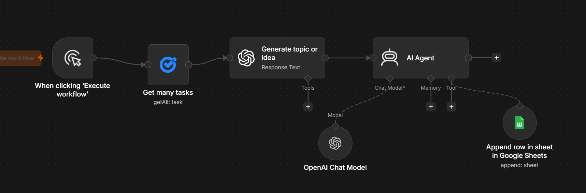

# n8n Social Media Workflow

Automate your LinkedIn content creation from start to finish. This workflow pulls your tasks from Google Tasks, turns them into fully written LinkedIn posts using an AI Agent powered by OpenAI, and saves everything — post text, hashtags, and platform — directly into a Google Sheet for easy tracking and scheduling.

No more staring at a blank screen wondering what to post. Just add your content ideas as tasks in Google Tasks, run the workflow, and get ready-to-publish LinkedIn posts delivered to your spreadsheet.

---

## Workflow

---

## What It Does

You maintain a list of content ideas or topics in Google Tasks. When you run this workflow, it:

1. Fetches all your tasks from Google Tasks.
2. Takes each task and generates a relevant content topic or angle from it.
3. Passes that topic to an AI Agent (powered by OpenAI) which writes a complete LinkedIn post — with a hook, body, and call to action.
4. Saves the output into a Google Sheet with three columns: the post text, hashtags, and the target platform (LinkedIn).

The result is a Google Sheet filled with ready-to-publish LinkedIn posts that you can review, tweak, and schedule at your convenience.

---

## Workflow Breakdown

The workflow consists of six connected nodes:

**Manual Trigger** — Starts the workflow when you click "Execute Workflow" inside n8n. No scheduling needed — you run it when you want fresh content.

**Get Many Tasks (Google Tasks)** — Connects to your Google Tasks account and pulls all tasks from a specified task list. Each task represents a content idea or topic you want to write about.

**Generate Topic or Idea (Response Text)** — Takes the raw task text and shapes it into a clear content topic or angle. This step bridges the gap between a rough idea ("write about automation") and a focused direction ("how automation saved me 10 hours a week").

**AI Agent** — The core of the workflow. This agent receives the refined topic, uses the OpenAI Chat Model to write a full LinkedIn post, and outputs polished content ready for publishing. The agent is configured with a system prompt that defines the tone, structure, and style of the posts.

**OpenAI Chat Model** — Powers the AI Agent. Handles the actual text generation. You can configure which model to use (GPT-4, GPT-3.5, etc.) depending on your needs and budget.

**Append Row in Google Sheets** — Takes the final output and appends it as a new row in your Google Sheet. Three columns are populated: the full post text, relevant hashtags, and the platform name.

---

## Google Sheets Output

The workflow writes to a Google Sheet with this structure:

| Post | Hashtags | Platform |
|------|----------|----------|
| Full LinkedIn post text with hook, body, and CTA | #automation #n8n #productivity | LinkedIn |

Each run adds new rows for every task processed, so your content library grows over time.

---

## How to Use

1. Download the `Social media workflow.json` file from this repository.
2. Open your n8n instance (self-hosted or cloud).
3. Go to **Workflows → Import from File** and select the downloaded JSON file.
4. Set up the required credentials in n8n:
   - **Google Tasks** — OAuth connection to your Google account.
   - **OpenAI** — Your OpenAI API key for the Chat Model.
   - **Google Sheets** — OAuth connection to your Google account (can be the same as Google Tasks).
5. Create a Google Sheet with three columns: `Post`, `Hashtags`, `Platform`.
6. Update the Google Sheets node in the workflow to point to your sheet.
7. Add your content ideas as tasks in Google Tasks.
8. Click **Execute Workflow** in n8n and check your Google Sheet for the generated posts.

---

## Requirements

- **n8n** — Self-hosted or n8n Cloud
- **Google Account** — For Google Tasks and Google Sheets access
- **OpenAI API Key** — For the AI Agent to generate posts

---

## Who Is This For

- Content creators who want to stay consistent on LinkedIn without spending hours writing.
- Professionals who have plenty of ideas but struggle to turn them into posts.
- Anyone who wants a simple system to batch-produce LinkedIn content.

---
